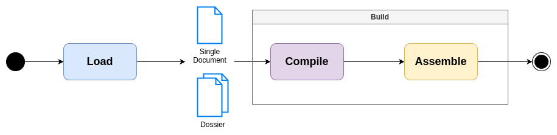

# New MarkDown [BETA]

**New way to write in markdown**

[](LICENSE)
[](CHANGELOG.md)

NMD stands for **New MarkDown**, or for friends, *Nicola MarkDown* (if Stephen Bourne can name a shell, why can't I name mine NMD?)

- [New MarkDown \[BETA\]](#new-markdown-beta)
  - [Overview](#overview)
  - [Add NMD core in your project](#add-nmd-core-in-your-project)
  - [Develop](#develop)
  - [NMD Syntax](#nmd-syntax)
  - [Author](#author)
  - [Contributing](#contributing)
  - [License](#license)


## Overview

`nmd-core` is the *core* of [NMD](https://github.com/nricciardi/nmd). It can be used to load and build NMD files or dossier.

If you want know more about NMD, please, you should open this [link](https://github.com/nricciardi/nmd).




## Add NMD core in your project

```shell
cargo add nmd-core
```


## Develop

Develop [check list](DEVELOP.md)

## NMD Syntax

[NMD Standard Syntax](NMD.md)

> [!WARNING]
> NMD syntax is working in progress yet, you can contribute following [contribution guidelines](CONTRIBUTING.md)!


## Author

Nicola Ricciardi

## Contributing

If you would like to contribute to the development of the NMD compiler, please follow [contribution guidelines](CONTRIBUTING.md).

## License

This project is licensed under the GNU General Public License v3.0 - see the [LICENSE](LICENSE) file for details.
