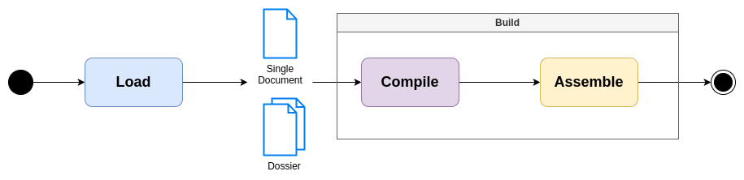

[](LICENSE)
[](CHANGELOG.md)

# NMD core

`nmd-core` is the *core* of [NMD](https://github.com/nricciardi/nmd). It can be used to load and build NMD files or dossier.

If you want know more about NMD, please, you should open this [link](https://github.com/nricciardi/nmd).

To get start add `nmd-core` to your project:

```shell
cargo add nmd-core
```



```rust
let dossier_path = PathBuf::from(...)

let format = OutputFormat::Html;

let codex = Codex::of_html(CodexConfiguration::default());


// === Load ===

let loader_configuration = LoaderConfiguration::default();

let mut dossier = Loader::load_dossier_from_path_buf(dossier_path, &codex, &loader_configuration)?;


// === Compile ===

let compilation_configuration = CompilationConfiguration::default();

let compilation_configuration_overlay = Arc::new(RwLock::new(CompilationConfigurationOverLay::default()));

Compiler::compile_dossier(&mut dossier, &format, &codex, &compilation_configuration, compilation_configuration_overlay)?;


// === Assemble ===

let html_assembler_configuration = HtmlAssemblerConfiguration::default();

let artifact = HtmlAssembler::assemble_dossier(&dossier, &html_assembler_configuration)?;


// === Dump === 

let dump_configuration = DumpConfiguration::new(...);

artifact.dump(&dump_configuration)?;
```

## Documentation

[Full documentation](target/doc/nmd_core/index.html)

## NMD Syntax

[NMD Standard Syntax](NMD.md)

> [!WARNING]
> NMD syntax is working in progress yet, you can contribute following [contribution guidelines](CONTRIBUTING.md)!


## Develop

Develop [check list](DEVELOP.md)

### Known issues

- [x] Paragraphs and text are not parsed in tables
- [ ] Nested text modifiers could be compiled wrongly (e.g. `*this is a **phrase** with some bold*.`)
- [ ] List with empty lines between two items
- [ ] Missed `tab` as modifier
- [ ] Missed style for simples quotes
- [ ] Text between two list items

## Author

Nicola Ricciardi

## Contributing

If you would like to contribute to the development of the NMD compiler, please follow [contribution guidelines](CONTRIBUTING.md).

## License

This project is licensed under the GNU General Public License v3.0 - see the [LICENSE](LICENSE) file for details.
